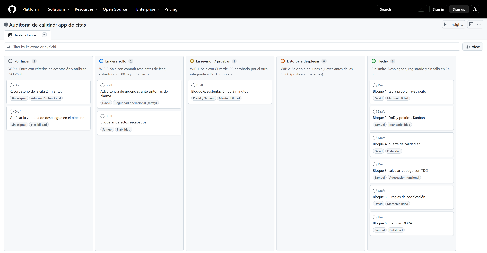

# Tablero del equipo (GitHub Projects)

Tablero que respalda `docs/politicas_kanban.md`. Equipo: David y Samuel Ossa Escobar.

- Enlace público: https://github.com/users/daviid0611/projects/4 (vista "Tablero Kanban").
- Captura:

## 1. Proyecto

1. Proyecto `Auditoría de calidad: app de citas` en la cuenta `daviid0611`, público y enlazado al repositorio `auditoria-calidad-agil`. Vista **Tablero Kanban** con diseño *Board*.
2. Campo personalizado **Atributo ISO 25010** (tipo *Single select*) con las opciones: Adecuación funcional, Capacidad de interacción, Fiabilidad, Seguridad, Mantenibilidad, Flexibilidad, Seguridad operacional (safety).
3. Campo personalizado **Responsable** (*Single select*): David, Samuel, David y Samuel, Sin asignar. Se usa en lugar de *Assignees* porque las tarjetas son borradores (*draft*) y Samuel aún no es colaborador del repositorio.
4. Se creó con la CLI de GitHub (`gh project create`, `gh project field-create`, `gh project item-create`, `gh project item-edit`), así que se puede reconstruir igual.

## 2. Columnas y límites WIP

Las columnas salen del campo **Status**. Sus opciones, en orden, son las columnas; la descripción de cada opción (visible bajo el título de la columna) resume su límite WIP y su política de salida:

| Orden | Columna (opción de Status) | Límite WIP |
|---|---|---|
| 1 | Por hacer | 4 |
| 2 | En desarrollo | 2 |
| 3 | En revisión / pruebas | 1 |
| 4 | Listo para desplegar | 2 |
| 5 | Hecho | Sin límite |

Para poner el límite: menú **...** de la columna > **Set column limit** > escribir el número > **Save**.

GitHub Projects solo **muestra** el límite: resalta la columna cuando se pasa, pero no impide agregar tarjetas. Por eso el límite es una política del equipo. Si la columna se ve resaltada, la política se está incumpliendo y eso se puede verificar en la captura.

## 3. Tarjetas iniciales

Cada tarjeta tiene en su descripción el criterio de aceptación y el atributo, y los campos "Atributo ISO 25010" y "Responsable" diligenciados. Para agregar una nueva: **+ Add item** en la columna.

### Tarjetas del taller

| # | Título | Criterio de aceptación (sí/no) | Atributo ISO 25010 | Responsable | Columna en la captura |
|---|---|---|---|---|---|
| 1 | Bloque 1: tabla problema-atributo | `docs/atributos_iso25010.md` tiene 4 filas con subcaracterística, fórmula y meta | Mantenibilidad | David | Hecho |
| 2 | Bloque 2: DoD y políticas Kanban | `docs/DoD.md` tiene 6 criterios con evidencia y `docs/politicas_kanban.md` tiene WIP y políticas encadenadas | Mantenibilidad | Samuel | Hecho |
| 3 | Bloque 4: puerta de calidad en CI | El workflow quedó en rojo con `NotImplementedError` y en verde tras la implementación | Fiabilidad | David | Hecho |
| 4 | Bloque 3: `calcular_copago` con TDD | El commit `test:` en rojo es anterior al commit `feat:` y la cobertura es ≥ 80 % | Adecuación funcional | Samuel | Hecho |
| 5 | Bloque 3: 5 reglas de codificación | Cada regla se verifica con sí/no y `src/citas.py` las cumple | Mantenibilidad | David | Hecho |
| 6 | Bloque 5: métricas DORA | `scripts/dora.py` da mediana 20 h, fallo 20 % y recuperación 4,5 h | Fiabilidad | Samuel | Hecho |
| 7 | Bloque 6: sustentación de 3 minutos | Guion ensayado en 3 minutos o menos y revisado por el otro integrante | Mantenibilidad | David y Samuel | En revisión / pruebas |

### Tarjetas del producto (siguiente sprint de la startup)

Muestran el tablero funcionando con los límites WIP.

| # | Título | Criterio de aceptación (sí/no) | Atributo ISO 25010 | Responsable | Columna en la captura |
|---|---|---|---|---|---|
| 8 | Advertencia de urgencias ante síntomas de alarma | Al escribir un síntoma de la lista de alarma, la app muestra la advertencia antes de ofrecer cita (prueba parametrizada al 100 %) | Seguridad operacional (safety) | David | En desarrollo |
| 9 | Etiquetar defectos escapados | Todo defecto tiene la etiqueta `defecto-produccion` o `defecto-pre` y se puede calcular la tasa de defectos escapados del sprint | Fiabilidad | Samuel | En desarrollo |
| 10 | Recordatorio de la cita 24 h antes | El paciente recibe el recordatorio 24 h antes y hay prueba automatizada del cálculo de la hora de envío | Adecuación funcional | Sin asignar | Por hacer |
| 11 | Verificar la ventana de despliegue en el pipeline | El paso de despliegue falla si se ejecuta en viernes, sábado o domingo, o después de las 13:00 (salvo etiqueta `urgente`) | Flexibilidad | Sin asignar | Por hacer |

Conteo para la captura: Por hacer 2 de 4, En desarrollo 2 de 2, En revisión / pruebas 1 de 1, Listo para desplegar 0 de 2, Hecho 6. Ninguna columna supera su límite.

## 4. Captura

- `docs/tablero.png` se tomó del enlace público sin sesión iniciada (Edge a 1920 px de ancho), así que muestra lo mismo que ve el docente al abrir el enlace.
- Al mover tarjetas, vuelva a tomar la captura desde el mismo enlace y reemplace el archivo.
